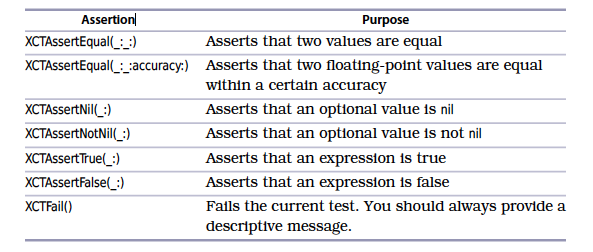

# iOS Unit Testing

- ### **Working Effectively with Legacy Code**

## What Are Unit Tests Anyway?
- Unit tests are a subset of automated tests where the feedback is quick, consistent, and unambiguous.
- Quick: A single unit test should complete in milliseconds. We want thousands of such tests.
- Consistent: Given the same code, a unit test should report the same results.The order of test execution shouldn’t matter. Global state shouldn’t matter.
- Unambiguous: A failing unit test should clearly report the problem it detected.

## Avoid Conditionals in Tests
- For example, it might be tempting to test a Boolean result like this:
```swift
func test_avoidConditionalCode() {
    let success = false
    if !success {
        XCTFail()
    }
}
```
- That would be fine if we didn’t have other assertions. But we do. Try adding and running this next test. It achieves the same result but in a more declarative way.
```swift
func test_assertTrue() {
    let success = false
    XCTAssertTrue(success)
}
```
- By using the Boolean assertions XCTAssertTrue() and XCTAssertFalse(), we can avoid
many conditionals in our test code.

## Describe Objects upon Failure
```swift
struct StructWithDescription: CustomStringConvertible {
    let x: Int
    let y: Int
    var description: String { "(\(x), \(y))" }
}
func test_assertNil_withSelfDescribingType() {
    let optionalValue: StructWithDescription? =
    StructWithDescription(x: 1, y: 2)
    XCTAssertNil(optionalValue)
}
```
- Running this test gives us the following simplified failure message: XCTAssertNil failed: "(1, 2)" - XCTAssertNil() is one assertion that gives more information. That’s because it takes an object instead of a Boolean value. The assertions for equality also give more information, and we’ll look at them next. Even in the cases where we provide our own descriptive messages, it’s good to have an option to simplify the output. Keep CustomStringConvertible in your tool belt.

## Equality with Doubles and Floats
```swift
func test_floatingPointDanger() {
    let result = 0.1 + 0.2
    XCTAssertEqual(result, 0.3)
}
```
- Before running the test, try predicting the outcome. Do you have an expected result in your head?
- Okay, now run the test. You’ll see the following failure message: XCTAssertEqual failed: ("0.30000000000000004") is not equal to ("0.3") - What in the world is going on?
- We’re used to using ten digits to represent numbers. Can you write 1⁄3 in decimal notation? No. The sequence 0.3333… goes on forever, so anything you write down is an approximation. That’s just the way math works. Computers face the same problem, but everything boils down to 1s and 0s, so the tricky numbers are different. We report erratum • discuss Fudge Equality with Doubles and Floats • 13 can’t write 1⁄10 in binary notation. You can learn more about this at “What Every Programmer Should Know About Floating-Point Arithmetic.”1 Let’s get back to assertions. Since floating-point numbers are approximations, we need a hand-wavy way to assert equality—something that says, “These two numbers should be equal, more or less.” 
- Enter the following test:
```swift 
func test_floatingPointFixed() {
    let result = 0.1 + 0.2
    XCTAssertEqual(result, 0.3, accuracy: 0.0001)
}
```

- The accuracy parameter gives us a way to express the “more or less” fudge factor. Run this test and you’ll see that it passes. It’s hard to predict in advance which floating-point numbers will cause problems. So just use the accuracy parameter whenever you want to use XCTAssertEqual() with Double or Float types.

- Remember, when XCTAssertEqual() or XCTAssertNil() fail, they provide a fair bit of information. It’s usually enough. XCTAssertTrue() and XCTAssertFalse() only say they failed, but that too is often enough. We’re going to aim for tests that are so short, we won’t need to add any messages of our own.

## Choose the Right Assertion


-------------------

# Manage Your Test Life Cycles (Folder `LifeCycle` in project)

## Observe Object Life Cycles to Learn the Phases of a Test
## FIRST Principles of Good Unit Tests
- [F]ast
- [I]solated
- [R]epeatable
- [S]elf-validating
- [T]imely


### Fast
- Unit tests should be fast otherwise they will slow down your development/deployment time and will take longer time to pass or fail. Typically on a sufficiently large system, there will be a few thousand unit tests – let’s say 2000 unit tests. If the average unit test takes 200 milliseconds to run (which shall be considered fast), then it will take 6.5 minutes to run complete suite. 6.5 minutes doesn’t seem long at this stage, but imagine if you run them on your development machine multiple times a day which will eat up your good amount of productive time. And imagine when the count of these tests increases when new functionalities are added to the application, it will further increase the test execution time. The value of your suite of unit tests diminishes as their ability to provide continual, comprehensive, and fast feedback about the health of your system also diminishes. One of the major causes of slow tests – is dependency that must handle external evil necessities such as databases, files, and network calls. They take thousands of milliseconds. So to make suite fast, you must avoid creating these dependencies by using mock testing.

### Isolated
- Never ever write tests which depend on other test cases. No matter how carefully you design them, there will always be possibilities of false alarms. To make the situation worse, you may end up spending more time figuring out which test in the chain has caused the failure. In the best-case scenario, you should be able to run anyone test at any time, in any order. By making independent tests, it’s easy to keep your tests focused only on a small amount of behavior. When this test fails, you know exactly what has gone wrong and where. No need to debug the code itself. The Single Responsibility Principle (SRP) of SOLID Class-Design Principles​ says that classes should be small and single-purpose. This can be applied to your tests as well. If one of your test methods can break for more than one reason, consider splitting it into separate tests.

### Repeatable
- A repeatable test is one that produces the same results each time you run it. To accomplish repeatable tests, you must isolate them from anything in the external environment, not under your direct control. In these cases, feel free to use mock objects. They have been designed for this very purpose. On occasion, you’ll need to interact directly with an external environmental influence such as a database. You’ll want to set up a private sandbox to avoid conflicts with other developers whose tests concurrently alter the database. In this situation, you may use in-memory databases. If tests are not repeatable then you will surely get some bogus test results and you can’t afford to waste time chasing down phantom problems.

### Self-validating
- Tests must be self-validating means – each test must be able to determine that the output is expected or not. It must determine it is failed or pass. There must be no manual interpretation of results. Manually verifying the results of tests is a time-consuming process that can also introduce more risk. Make sure you don’t do anything silly, such as designing a test to require manual arrange steps before you can run it. You must automate any setup your test requires – even do not rely on the existence of database and pre-cooked data. Create an in-memory database, create schema and put dummy data and then test the code. In this way, you can run this test N number of times without fearing any external factor which can affect test execution and it’s result.

### Timely
- Practically, You can write unit tests at any time. You can wait up to code is production-ready or you’re better off focusing on writing unit tests in a timely fashion. As a suggestion, you should have guidelines or strict rules around unit testing. You can use review processes or even automated tools to reject code without sufficient tests. The more you unit-test, the more you’ll find that it pays to write smaller chunks of code before tackling a corresponding unit test. First, it’ll be easier to write the test, and second, the test will pay off immediately as you flesh out the rest of the behaviors in the surrounding code.

## **Learn How XCTest Manages Test Cases**
- By applying the wrong way to reduce duplication, we’ve stumbled onto a mystery. Why are objects piling up before we run a single test? To solve this mystery, we’re going to dig into how XCTest creates and runs test cases. It’s easy to assume that when XCTest runs a test case, three things happen:
1. It creates an instance of the XCTestCase subclass.
2. It runs the specific test method.
3. It destroys the XCTestCase instance.
- Or, you may have assumed that XCTest creates one instance to run all the tests in a suite. But both are incorrect. Here’s what really happens:
1. XCTest searches for all classes that inherit from XCTestCase.
2. For each such class, it finds every test method. These are methods whose names start with test, take no arguments, and have no return value.
3. For each such test method, it creates an instance of the class. Using Objective-C runtime magic, it remembers which test method that instance will run.
4. XCTest collects the instances of the subclass into a test suite.
5. When it’s finished creating all test cases, only then does XCTest begin running them. What this means for our example is that XCTest finds MyClassTests. It searches for method names starting with “test,” and it finds two. So it creates two
- instances of MyClassTests: one instance to run test_methodOne(), another to run
test_methodTwo(). And it assembles these instances into a test suite before running any tests. Since each instance has a MyClass property, we’ve accidentally created two instances of MyClass.

> When Is XCTestCase a Test Case?
>
> Why does XCTestCase look like a test suite, when it has a name that says it’s a test case? The difference is between when we’re writing test code and when XCTest is running them. We can put several test methods inside an XCTestCase subclass. From our point of view of writing or reading test code, MyClassTests is a test suite. But it’s more accurate to say it will become a test suite. When XCTest runs, it creates a separate instance for each test method. So each instance of MyClassTests is a single test case, from XCTest’s point of view.

- **Use setUp() and tearDown()**
- Having looked at the wrong way to tackle test code duplication, what’s the right way? XCTestCase provides special methods for us to use. First, let’s set a term for “stuff the test needs in order to run.” The term we’re looking for is test fixture. Since our two tests use the same test fixture, we want to move it outside the tests. But simply promoting sut to a property didn’t work. So what do we do? XCTestCase defines two methods, setUp() and tearDown(). They’re designed to be overridden in subclasses. Combined with careful use of optionals.

- Run the tests and examine the log. You’ll see that XCTest created and destroyed the MyClass instances within each test run. Hurray! For Swift in particular, the trick is to declare the objects in our shared test fixture using var instead of let. We also add the ! to make these variables implicitly unwrapped optionals:

```swift
private var sut: MyClass!
```
- This may cause you some initial discomfort. Experienced Swift programmers call ! the “crash operator,” and do their best to avoid it. But the implicitly unwrapped optional is a necessity here, just as it is for an IBOutlet. XCTest is a framework, meaning it calls back to our code. setUp() and tearDown() are template methods as defined by Design Patterns: Elements of Reusable Object-Oriented Software [GHJV95]. The test runner in XCTest guarantees the following sequence for each test case:
1. Call setUp().
2. Call the test method.
3. Call tearDown().
- So rest easy. As long as you create what you need inside setUp(), the implicitly unwrapped optionals won’t crash. And without them, we’re creating a context of unpredictable chaos for our tests. Type the exclamation point. It’s the right thing for XCTestCase properties. Note that setUp() alone isn’t enough. XCTest creates test instances, but it never destroys them. Their properties will live on, so we need tearDown() to clean up any remains of our shared test fixtures.

>**Don’t Abuse setUp()**
>
>Whenever we programmers learn a new trick, we have a tendency to overuse it. Be careful not to overuse setUp(). It can become a dumping ground for things used by only some of the test cases. This in turn makes it hard to reason about the tests when we read them. Try to limit setUp() to things that matter to most tests in a suite.
----------------------
## Measure Code Coverage and Add Tests
- **Enable Code Coverage**
1. In the Xcode menu, select Product ▶ Scheme ▶ Edit Scheme.
2. In the scheme editor, select Test in the left column.
3. Then from the tabs, select Options.
4. Finally, enable the Code Coverage check box to “Gather coverage for all targets.”

- **Examine Code Coverage Results**


>Does Old Code Need Tests?
>
>Most code in a shipping app has been in use for some time. Do you even need to write tests for such code? No. That is, not as long as that code doesn’t change.
>But as soon as you need to change a section of code, write tests for that section before making any changes.

> **Don’t fret trying to cover code you know to be unreachable.**
> **Try to cover every side of a conditional. Remember that an if without an else still requires two tests, checking the behavior when the statements are not executed.**

>What If There Are Too Many Paths?
>
>We should try to have one test for each independent path through a function. But in legacy code, the number of paths (and as a result, the number of tests) can explode. One way to tame this explosion is to extract a nested conditional into its own method. So if you have an if inside another if, select the inner clause. Then in the Xcode menu, select Editor ▶ Refactor ▶ Extract to Method. Remove the fileprivate declaration from the new function so that tests can access it. Now you can write tests to cover the new function on its own. Another way to tame the explosion is to look for combinations that shouldn’t exist. We can often eliminate impossible states by using enumeration cases with associated values. To explore this further, see Mislav Javor’s “Swift Enums Are ‘Sum’ Types. That Makes Them Very Interesting.”a Code analysis tools that measure cyclomatic complexity can help you identify functions that need too many tests.

## Cover a Loop
- It’s tempting to cover a loop with a single test that loops several times. But this misses an important boundary condition. What if the loop is never entered? We want to see what happens if the statements inside are skipped.

>To cover an arbitrary loop, use zero times through and a few times through—say, two or three times.

## Cover Statements in a Sequence
- The statements in sequence we’ll focus on are the didSet observer on the width property. Let’s test the outcome of the first line, which calculates the area from a given width.

## Avoid Percentage Targets, Embrace Forward Movement
- Adding tests to a legacy project is a long endeavor. Let’s take a step back from code examples and look at practices to avoid—and practices to embrace.
- Avoid setting percentage targets for code coverage. Goodhart’s Law expresses the problem with such targets:1
- When a measure becomes a target, it ceases to be a good measure. As you’ve seen, it’s easy to raise the numbers without having meaningful tests. That’s exactly what folks will do if the team uses coverage as a target instead of as a measurement of trends.
- Another thing to avoid: don’t write tests that set and get stored properties. Such tests don’t say anything about the code—they only show that the compiler works. Those properties are there for a reason. Find the reason, and test the reason instead.
- (But computed properties are just functions without arguments. Do test those.) Rather than setting a percentage target, your team might try this goal: move the needle forward. Any forward progress is significant and worth celebrating.
- Measure your total code coverage on a regular cadence—maybe every two weeks or every month. It’s helpful to capture more than the percentage alone. Use a tool like cloc2 to count lines of code. Then apply the percentage to calculate how many lines of code are covered and how many aren’t. For example, if something with 5,000 lines has 20 percent line coverage, then 4,000 lines of code are definitely not covered. This will give you a clearer picture of totals, not just percentages.
- Observe the code coverage gutter every time you add a test. It may be a long road, but the positive feedback of seeing the red blocks disappear will boost your motivation.
